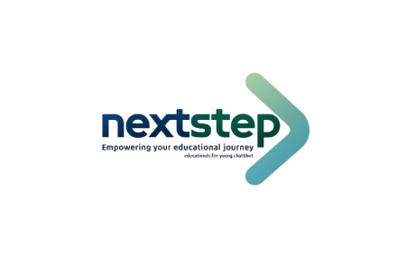

# NextStep 🥇

¡Bienvenido a NextStep, una plataforma innovadora de orientación vocacional! 🌟 Nuestro proyecto está diseñado para ayudar a jóvenes de 18 a 24 años a elegir o redefinir su carrera profesional a través de un chatbot interactivo basado en inteligencia artificial.




## 📋 Descripción del Proyect

NextStep aborda una problemática crítica en España: la alta tasa de abandono escolar, especialmente entre los jóvenes de 18 a 24 años. Muchos jóvenes eligen carreras sin tener suficiente información sobre sus intereses, los rangos salariales de sus futuros empleos, y la oferta y demanda del mercado laboral. Este desconocimiento puede llevar a decisiones inadecuadas y, en última instancia, al abandono de sus estudios.

### 🎯 Objetivo de NextStep

Nuestra misión es proporcionar un asesoramiento personalizado que ayude a los estudiantes a identificar carreras que se alineen con sus habilidades y pasiones, ofreciendo información clara y accesible sobre sus opciones académicas y profesionales. A través de un chatbot interactivo, buscamos acompañar a los usuarios en su proceso de autodescubrimiento y toma de decisiones académicas.

### 🔑 Características Principales

1. **Chatbot de orientación vocacional con IA**: Utiliza procesamiento de lenguaje natural (NLP) para interactuar con los estudiantes mediante preguntas adaptativas.
2. **Recomendaciones personalizadas**: Sugerencias de carreras basadas en las respuestas del usuario, incluyendo información sobre opciones académicas, perspectivas laborales y rangos salariales.
3. **Reorientación**: El chatbot reorienta a los usuarios si deciden cambiar su camino profesional.
4. **Perfil dinámico**: Evoluciona según las interacciones del usuario con el chatbot.
5. **Acompañamiento a largo plazo**: Seguimiento continuo para evaluar las preferencias y habilidades del usuario.

### **Visión y Propósito**

NextStep busca reducir la tasa de abandono escolar en España al ofrecer información y apoyo durante uno de los momentos más críticos en la vida académica de un joven. Queremos que los estudiantes no solo elijan una carrera que les apasione, sino que también tengan la confianza de conocer las oportunidades laborales que les esperan.

## 🚀 Tecnologías Utilizadas

- **IA y machine learning**: Para análisis de perfiles y recomendaciones personalizadas.
- **Procesamiento de lenguaje natural (NLP)**: Para interacciones fluidas con el chatbot.
- **Plataforma Web/Móvil**: NextStep estará disponible como una plataforma accesible desde dispositivos móviles y ordenadores.

## 📋 Requisitos Previos

Antes de comenzar, asegúrate de tener instalados los siguientes componentes:

- Node.js y npm (Node Package Manager)

## 🛠️ Instalación de Node.js

Si aún no tienes Node.js instalado, sigue estos pasos:

1. **Descarga Node.js desde:** [nodejs.org](https://nodejs.org/en)
2. **Verifica la instalación:**

   ```bash
   node -v
   npm -v

## 🛠️ Configuración del Proyecto

1. **Incluye la clave API GROQ en el archivo .env local:**

GROQ_API_KEY=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

2. **Abre una terminal en la carpeta del proyecto (NextStep) y ejecuta:**

python app/chatbot.py

3. Luego, abre otra terminal y ejecuta los siguientes comandos:

npm install
npm run api
npm run start

## 🌐 Uso de la Aplicación

Abre tu navegador en http://localhost:3000 para interactuar con NextStep y explorar sus funcionalidades.

## 🚀 Mejoras Futuras

- Integración de mentores y tutores para asesoramiento personalizado.
- Plataforma de seguimiento para evaluar el éxito de las recomendaciones.
- Integración de datos de mercado laboral para ofrecer información actualizada.
- Aplicación móvil para una experiencia de usuario más fluida.
- Registro de usuario y login con conexión a una base de datos real.
- Avatar 3D interactivo con el que podrás dialogar para una experiencia más inmersiva.
